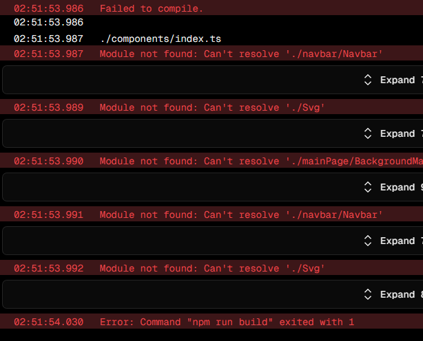
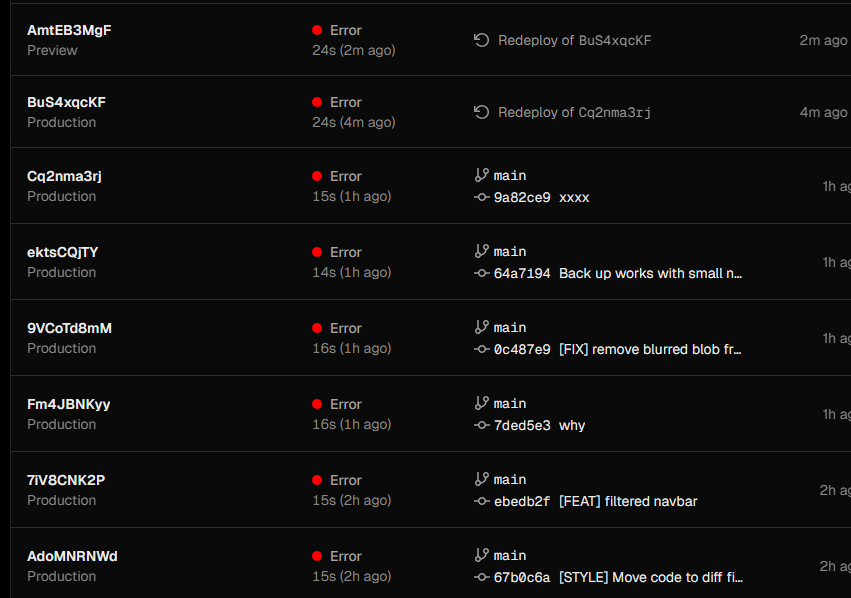
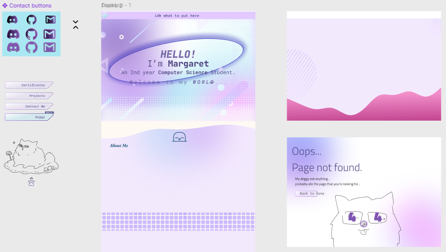

# Website Dev Notes

- [Website Dev Notes](#website-dev-notes)
  - [Framework and Libraries](#framework-and-libraries)
    - [Compiler, CLI and Node.js](#compiler-cli-and-nodejs)
    - [Installation](#installation)
  - [Development](#development)
    - [File Structure](#file-structure)
    - [Rendering](#rendering)
    - [Useful shortcuts](#useful-shortcuts)
    - [Screen size](#screen-size)
    - [Next.js redirect](#nextjs-redirect)
  - [Deployment errors](#deployment-errors)
  - [Reflections](#reflections)
    - [Design on Figma](#design-on-figma)
    - [Thoughts about TailwindCSS](#thoughts-about-tailwindcss)

---

## Framework and Libraries

- **Routing**: Next.js App Router
- **Global State Management**: React Context API
- **Styling**: TailwindCSS
- **Animations**: Framer Motion
- **Icons**: React Icons
- **Audio**: Howler.js and useSound

See package.json for more details.

### Compiler, CLI and Node.js

- Compiler: transforms & minifies JS code
- CLI: builds and starts apps, `npm run build`, `npm run dev`
- Node.js: Runtime, executes JS code on the server

---

### Installation

See Next.js [docs](https://nextjs.org/docs/app/getting-started/installation).

```powershell
npx create-next-app@latest
√ What is your project named? ... koi
√ Would you like to use TypeScript? ... Yes
√ Would you like to use ESLint? ... No
√ Would you like to use Tailwind CSS? ... Yes
√ Would you like your code inside a `src/` directory? ... No
√ Would you like to use App Router? (recommended) ... Yes
√ Would you like to use Turbopack for `next dev`? ... Yes
√ Would you like to customize the import alias (`@/*` by default)? ... No
```

---

## Development

### File Structure

See [file structure](./file-tree.md).

### Rendering

- **Client**-side rendering (CSR)
  - Front-end, runs in the browser
  - e.g. Event listeners, states, use effects, APIs
  - Files outside `app/` or those marked with the `use client` directive
- **Server**-side rendering (SSR)
  - Back-end
  - e.g. Data fetching, static components like side bar

### Useful shortcuts

- React Arrow Function Component Export: `rafce`
- `rfc`: export default function
- `rafcp`: export default function with props

### Screen size

Use `xl` for large screen

### Next.js redirect

- `redirect`: Server-side redirect, e.g.:
  - login redirect if no error
  - external URLs
- `useRouter` hook: Client
  - event handlers
  - recommended to use `<Link>`

## Deployment errors

I encountered deployment errors on Vercel even though `npm run build` worked locally.



(And i ignored the error and kept pushing other changes lmao)


**Cause**: Git cache didn't track changes in file name casing, so parts of the remote repos were outdated.

**Solution**: Based on [this post](https://stackoverflow.com/questions/62378045/how-to-fix-next-js-vercel-deployment-module-not-found-error), I fixed it by running:

```powershell
git rm -r --cached .
git add --all .
git commit -a -m "Versioning untracked files"
git push origin master
```

---

## Reflections

This is my second time working on a React/Next.js project. My first experience was a group project for school, where I mainly focused on the user authentication and didn’t have much control over the project structure or design. So building this web app from scratch was still kind of overwhelming for me at first.

### Design on Figma

I definitely spent too much time on the design... probably procrastinating on the coding part. Did I actually improve my Figma skills? Maybe just a little. Did I waste time that I could’ve used for coding and starting other projects earlier? Yes.



Spent quite a lot of time to solve performance issues because code I wrote at the beginning wasn't optimised and wasn't clear. After many refactors I managed to get a "better" code structure and lighthouse score. But still have a large room for improvement especially on mobile performance.

### Thoughts about TailwindCSS

It works well if the design is simple and doesn't require a lot of custom styles. Many people says it make the code messy but I usually store `classNames` as string in constants and use `cn` function to merge them, so it hasn't really been a problem for me.

However, since I am doing pastel gradient designs, I often end up using traditional CSS or inline styling. Probably TailwindCSS isn't necessary for my case.
