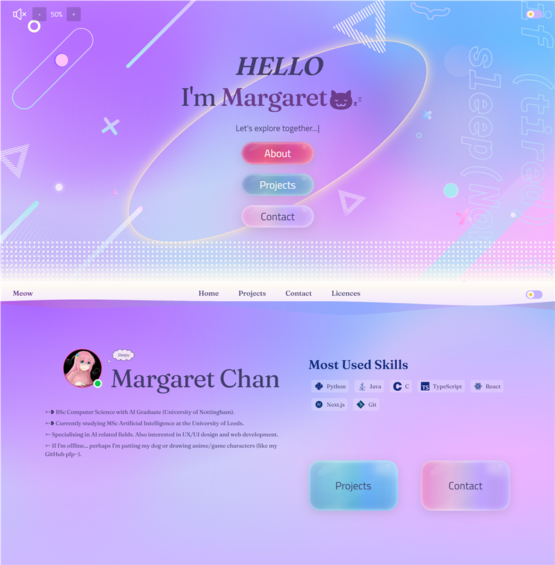

# My portfolio website ♡

Built with Next.js + TypeScript.

- Live demo: <https://sum1070.vercel.app>

[](https://sum1070.vercel.app)

## Features

- Pastel palette with glassmorphism and memphis decorations
- Light/dark mode toggle
- Cozy background music with sound effects (mutable)
- Smooth animations built with Motion
- Markdown rendering for project writeups
- Rich text support for markdown
- Fully responsive

## Tech stack

- **Framework**: Next.js (App Router) + TypeScript
- **Styling**: TailwindCSS
- **Animations**: Motion
- **Audio**: Howler.js and useSound
- **Markdown**: React Markdown + remark-gfm
- **Deployment**: Vercel

---

## Run locally

```powershell
cd koi
npm i
npm run dev
```

## Project structure

- `koi/app`: routes and pages
- `koi/components`: reusable components (theme, buttons, visual elements, etc.)
- `koi/data/projects`: project data (config + markdown)
- `docs/`: developer notes and guides

## Docs

- [Dev notes](docs/v2-dev-notes.md): Project writeup and documentation for the current version
- [Dev notes (**archive**)](docs/v1-dev-notes.md): notes from v1 of the website
- [Adding a project](docs/add-projects.md): How project entries are added

## License

Asset licences and attributions are listed on the site's [licences page](https://sum1070.vercel.app/licences).
